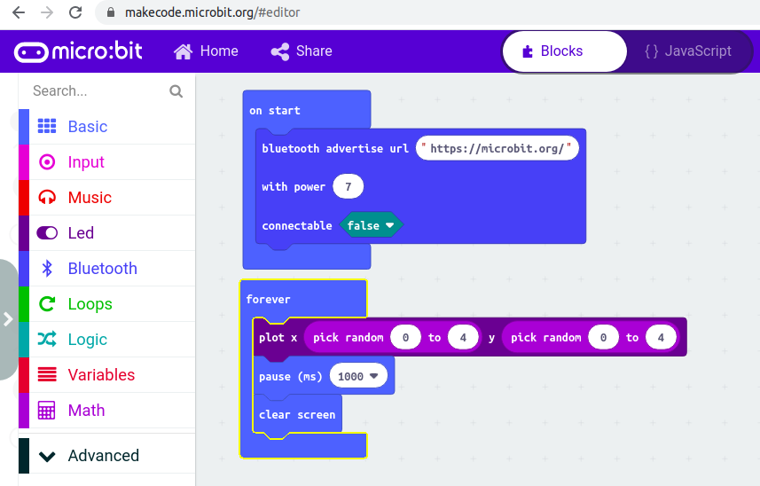

# BLE Beacon Scanner
## STEM workshop reading Bluetooth beacons
### Overview of aims
Bluetooth Low Engergy (BLE) beacons are becoming more well known with the likes
of Apple's iBeacon and Google's Eddystone (Physical Web).

The aim is to take this technology and show that it is accessible to students
and the maker community. By showing it is accessible, the hope is that people then
take some of the ideas and use them for positive and creative endeavours.

The hope is that this library/project will evolve as lessons are learnt about
how to make this technology accessible to the target audience.

The target audience is someone that has some basic understanding and
experience of programming with Python, but may not have done anything with
Bluetooth. They are unlikely to have experience with bytes, little-endian etc.

To assist with the accessibility goal, hardware will be targeted that is likely
to be available (and understood) by schools, code club etc.

Some assumptions being made at this time about the hardware:
* The Raspberry Pi's (RPi) will do the scanning for beacons
* The RPi's will be mains powered and so need to be static
* The beacons will be battery powered and could move if required.
* The beacons will be based on standards that are documented publicly

To allow for ease of adoption:
* Require minimal steps to install and run first example
* The workshop code will allow for it to be extendable so students
 could explore their own projects ideas based on what they have learnt
* Use a language familiar to schools. (This seems to be Python).

## Quickstart
### Install Bluetooth software on Raspberry Pi
Best practice would be to have setup instructions that don't include the use of
`sudo`, however a decision has been taken to prioritize convenience rather than
security. In the full documentation other options should be discussed.

To install the library directly from GitHub:
```
sudo pip install git+https://github.com/ukBaz/ble_beacon
```

### Scanning for beacons
This example will print the URL being broadcast by an Eddystone-URL beacon

```python
from scanner import protocols, hci_socket

for pkt in hci_socket.run():
    ad = protocols.AdvertEventHandler(pkt)
    if ad.eddystone_url:
        print(f'\tEddystone-URL: {ad.eddystone_url.url} @ {ad.rssi}dB')
``` 

If you save the above as `find_url_beacon.py` then to run it would be:
```
sudo python find_url beacon.py
```
An example expected output would be:
```
$ sudo python3 examples/beacon_finder.py 
        Eddystone-URL: https://microbit.org/ @ -39dB
        Eddystone-URL: https://microbit.org/ @ -48dB
```

## Creating a beacon
### Using your phone

For testing, you can use an Android or iOS device to simulate a beacon.

Android:
- https://play.google.com/store/apps/details?id=net.alea.beaconsimulator
- https://play.google.com/store/apps/details?id=com.davidgyoungtech.beaconscanner

iOS:
- ??

### Using a BBC micro:bit

One of the easier ways to create a beacon is using Makecode on the BBC micro:bit.



The code inside the `forever` loop is just to give visual feedback that
there is something running on the device.

You will also need to swap the `Radio` blocks for the `Bluetooth` blocks
which can be done by clicking on th cog in the top-right corner (not shown)
and selecting `Extensions` -> `Bluetooth`
