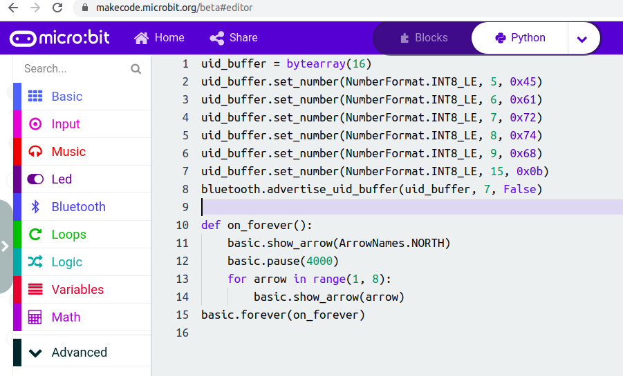
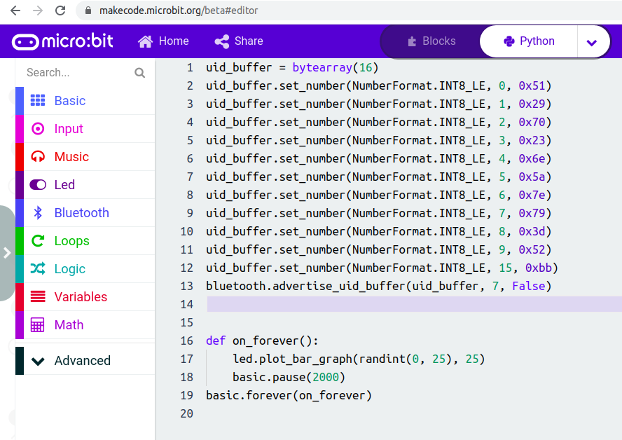

Workshop - Organiser
====================

Setting Up The Beacons
----------------------

Exercise 1
**********

Exercise 2
**********
For exercise 2 we will be using Eddystone UID beacons for the workshop attendees
to find. Use the same ``Instance ID`` for all the beacons so attendees can find
them easily.

The suggestion is to use: 11 (0x0b).

    Beacon 1:
        Target word: Earth

        Namespace ID: 297987634280

        Hex values: bytearray([0x45, 0x61, 0x72, 0x74, 0x68])

    Beacon 2:
        Target word: Jupiter

        Namespace ID: 20958273942611314

        Hex values: bytearray([0x4a, 0x75, 0x70, 0x69, 0x74, 0x65, 0x72])

    Beacon 3:
        Target word: Neptune

        Namespace ID: 22066581848026725

        Hex values: bytearray([0x4e, 0x65, 0x70, 0x74, 0x75, 0x6e, 0x65])

    Beacon 4:
        Target word: Mars

        Namespace ID: 1298231923

        Hex values: bytearray([0x4d, 0x61, 0x72, 0x73])

    Beacon 5:
        Target word: Saturn

        Namespace ID: 91678030787182

        Hex values: bytearray([0x53, 0x61, 0x74, 0x75, 0x72, 0x6e])

To do this with a BBC micro:bit, the code using Makecode would look like this:

Exercise 3
**********

For exercise 3 we will be using Eddystone UID beacons again. This time there
will be the names of farmyard animals encoded into the data for the workshop
attendees to find.

To make it simpler for attendees to find, use a different ``Instance ID``
from the previous exercise. Although, use the same value for all exercise 3
beacons.

The suggestion is to use: 187 (0xbb).

    Beacon 1:
        Target word: Cattle

        Namespace ID: 74085844675685

        Hex values: bytearray([0x4c, 0x74, 0x25, 0x37, 0x75, 0x59, 0x2d, 0x49, 0x6f, 0x64])

    Beacon 2:
        Target word: Sheep

        Namespace ID: 358233761136

        Hex values: bytearray([0x51, 0x29, 0x70, 0x23, 0x6e, 0x5a, 0x7e, 0x79, 0x3d, 0x52])

    Beacon 3:
        Target word: Chicken

        Namespace ID: 18973625288451438

        Hex values: bytearray([0x4c, 0x75, 0x68, 0x47, 0x5a, 0x59, 0x68, 0x60, 0x57, 0x23])

    Beacon 4:
        Target word: Rabbit

        Namespace ID: 90578215922036

        Hex values: bytearray([0x51, 0x65, 0x6b, 0x33, 0x5a, 0x58, 0x3e, 0x3c, 0x53, 0x70])

    Beacon 5:
        Target word: Horse

        Namespace ID: 311107416933

        Hex values: bytearray([0x4e, 0x4e, 0x3b, 0x6a, 0x3b, 0x57, 0x64, 0x48, 0x79, 0x47])

To do this with a BBC micro:bit, the code using Makecode would look like this:

